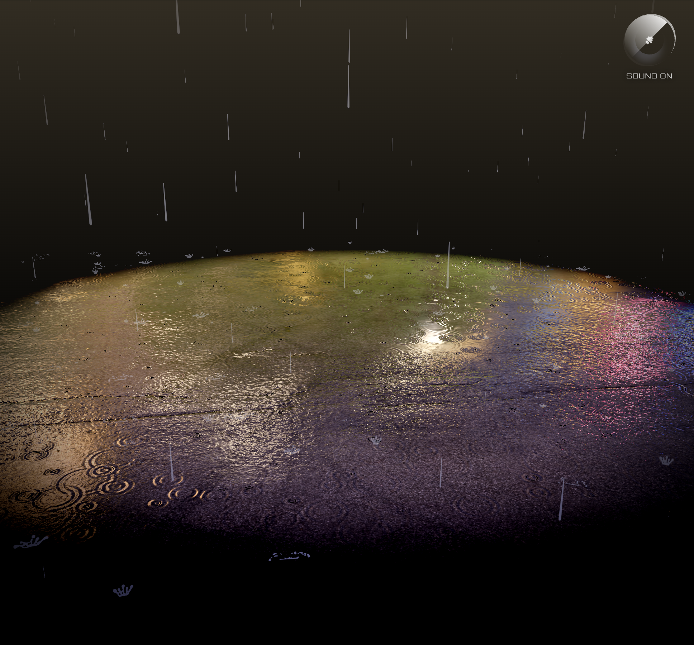

# Rain Puddle

[](https://react.dev/)
[](https://threejs.org/)
[](https://www.typescriptlang.org/)
[](https://vitejs.dev/)
[](https://docs.pmnd.rs/react-three-fiber)
[](https://howlerjs.com/)
[](https://styled-components.com/)
[](https://www.gnu.org/licenses/gpl-3.0)

**Interactive 3D rain puddle simulation** built with React Three Fiber.



## Features

- **Dynamic Rain System** — Thousands of falling raindrops with realistic physics
- **Procedural Puddle Shader** — Real-time ripples, reflections, and water effects with custom GLSL
- **Atmospheric Audio** — Rain ambience, night sounds, and thunder with lightning
- **Post-Processing** — Bloom and tone mapping for cinematic quality
- **Interactive Controls** — OrbitControls for free camera movement
- **Sound Toggle** — Enable/disable all audio with one click

## Tech Stack

| Technology | Version | Purpose |
|------------|---------|---------|
| **React** | 19.1.0 | UI framework |
| **Three.js** | 0.177.0 | 3D rendering engine |
| **@react-three/fiber** | 9.1.2 | React renderer for Three.js |
| **@react-three/drei** | 10.3.0 | Useful Three.js components & hooks |
| **@react-three/postprocessing** | 3.0.4 | Post-processing effects |
| **three-custom-shader-material** | 6.3.7 | Custom GLSL shaders for puddle |
| **Howler.js** | 2.2.4 | Audio engine |
| **Styled Components** | 6.1.1 | CSS-in-JS styling |
| **Vite** | 6.3.5 | Build tool |
| **TypeScript** | 5.0.4 | Type safety |

### Additional Dependencies

| Library | Purpose |
|---------|---------|
| **gl-noise** | GLSL noise functions for shaders |
| **simplex-noise** | Procedural noise generation |
| **motion** | Animation library |
| **react-icons** | Icon components |
| **r3f-perf** | Performance monitoring |
| **three-stdlib** | Three.js utilities |

## Project Structure

```
rain-puddle/
├── public/
│   ├── favicon.svg            # Website favicon
│   ├── image.png              # Screenshot for README
│   ├── sounds/
│   │   ├── light-rain-109591.mp3      # Rain sound effect
│   │   ├── night-ambience-17064.mp3   # Night atmosphere
│   │   └── thunderstorm-14708.mp3     # Thunder sound
│   ├── road/
│   │   ├── aerial_asphalt_01_ao_2k.jpg
│   │   ├── aerial_asphalt_01_diff_2k.jpg
│   │   ├── aerial_asphalt_01_nor_gl_2k.jpg
│   │   └── aerial_asphalt_01_rough_2k.jpg
│   └── decals/
│       └── trash/
│           ├── shmpulh_4K_Albedo.jpg
│           ├── shmpulh_4K_AO.jpg
│           ├── shmpulh_4K_Normal.jpg
│           ├── shmpulh_4K_Opacity.jpg
│           └── shmpulh_4K_Roughness.jpg
├── src/
│   ├── App.tsx                # Main component with UI overlay
│   ├── main.tsx               # Entry point
│   ├── SoundContext.tsx       # Audio state management
│   ├── useMakeRain.ts         # Rain control hook
│   ├── Lights.tsx             # Lighting & HDR environment
│   ├── styles.css             # Global styles
│   ├── vite-env.d.ts          # Vite environment types
│   ├── Floor/
│   │   ├── index.tsx          # Floor with puddle
│   │   ├── PuddleMaterial.tsx # Custom puddle shaders (GLSL)
│   │   └── Trash.tsx          # Decorative trash objects
│   └── Rain/
│       ├── index.tsx          # Rain system & audio
│       ├── Drops.tsx          # Raindrop particles
│       ├── Thunder.tsx        # Lightning & thunder effects
│       └── Splashes/
│           ├── index.tsx      # Splash particle system
│           └── useSplashPositions.ts # Splash position logic
├── index.html                 # HTML entry point
├── package.json               # Dependencies & scripts
├── package-lock.json          # Locked dependencies
├── tsconfig.json              # TypeScript configuration
├── tsconfig.app.json          # App-specific TS config
├── tsconfig.node.json         # Node-specific TS config
├── vite.config.ts             # Vite configuration
├── LICENSE                    # GPL-3.0 license
└── README.md                  # Project documentation
```

## Getting Started

### Prerequisites

- Node.js 18+
- npm or yarn

### Installation

```bash
# Clone the repository
git clone https://github.com/BitOpenCode/rain-puddle.git
cd rain-puddle

# Install dependencies
npm install

# Start development server
npm run dev
```

### Build for Production

```bash
npm run build
npm run preview
```

## Controls

| Action | Control |
|--------|---------|
| Rotate view | Click & drag |
| Zoom | Scroll |
| Start rain | Click "Start chill" button |
| Toggle sound | Click 🔊 button (top-right) |

## Credits

- **Original Concept & Code** — [Faraz Shaikh](https://github.com/Faraz-Portfolio)
- **Textures** — [Poly Haven](https://polyhaven.com/)
- **Audio** — [Pixabay](https://pixabay.com/)

## License

This project is licensed under the **GNU General Public License v3.0** — see the [LICENSE](./LICENSE) file for details.

```
Copyright (C) 2023 Faraz Shaikh

This program is free software: you can redistribute it and/or modify
it under the terms of the GNU General Public License as published by
the Free Software Foundation, either version 3 of the License, or
(at your option) any later version.
```

## Acknowledgments

- [React Three Fiber](https://docs.pmnd.rs/react-three-fiber) — Documentation & community
- [Three.js](https://threejs.org/) — 3D library
- [Custom Shader Material](https://github.com/utsuboco/three-custom-shader-material) — Shader utilities

---